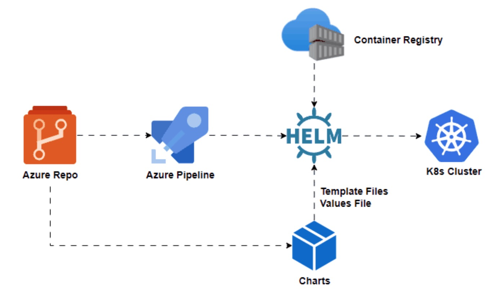
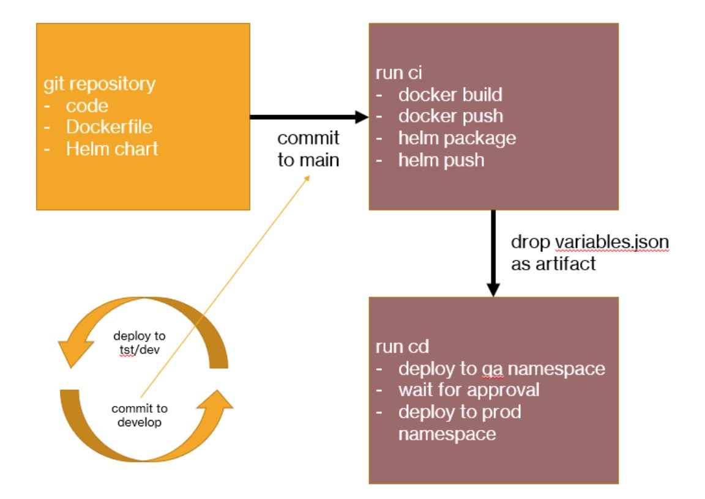

# Azure DevOps Pipeline for HelmChart Deployment Demo


### [View all Roadmaps](https://github.com/nholuongut/all-roadmaps) &nbsp;&middot;&nbsp; [Best Practices](https://github.com/nholuongut/all-roadmaps/blob/main/public/best-practices/) &nbsp;&middot;&nbsp; [Questions](https://www.linkedin.com/in/nholuong/)
<br/>


# Example app helm chart for Manning LP
Are you diving into the world of Kubernetes deployments and feeling a bit lost at sea? Don’t worry, Helm is here to rescue you! Let’s sail through Helm and make your Kubernetes journey smoother.



# 🤔 What is Helm?
Helm is a package manager for Kubernetes applications, designed to simplify the process of deploying, managing, and scaling containerized applications. Think of it as your go-to tool for streamlining the management of complex Kubernetes resources.

# 🏗️ Helm Structure:
The Helm structure consists of:

##### Charts: Bundles of pre-configured Kubernetes resources that define the structure of an application.
##### Templates: Dynamic YAML files within charts, allowing parameterization and customization.
##### Values: Configuration options that can be customized during deployment.
##### Charts Repository: A centralized location for sharing and discovering Helm charts.

# 🧩 Components in a Helm Chart:
When you crack open a Helm chart, you’ll find several key components

my-chart/
├── charts/
├── templates/
│ ├── NOTES.txt
│ ├── deployment.yaml
│ ├── service.yaml
│ └── ... (other k8s manifest files)
├── Chart.yaml
├── values.yaml
└── README.md
##### Chart.yaml: Metadata about the chart, including name, version, and dependencies.
##### Templates: Kubernetes manifest files with placeholders for dynamic values.
##### Values.yaml: Default configuration values for the chart.
##### Charts: Subcharts or dependencies required by the main chart.
##### README.md: Documentation providing instructions and guidance on using the chart.

## NOTES.txt: Helpful information and post-installation notes for users.

#⚙️ Helm Basic Commands:
Getting started with Helm is a breeze thanks to its intuitive command-line interface. Here are some essential commands:
```
helm create <chart_name>: Create a new chart.
helm install <release_name> <chart_name>: Install a chart.
helm upgrade <release_name> <chart_name>: Upgrade a deployed release.
helm list: List deployed releases.
helm uninstall <release_name>: Uninstall a release.
```

# The Azire CI big picture overview



The pipelines are designed to deploy to a qa environment and subsequently to production after an approval is given. The ci pipeline builds a container image and a Helm chart and stores both in Azure Container Registry (ACR). When that is finished, a pipeline artifact is stored that contains the image tag and chart version in a JSON file.

The cd pipeline triggers on the ci pipeline artifact and deploys to qa and production. It waits for approval before deployment to production. It uses environments to achieve that.

# CI pipeline
In the “ci” pipeline, the following steps are taken:

Retrieve the git commit SHA with $(build.SourceVersion) and store it in a variable called imageTag. To version the images, we simply use git commit SHAs which is a valid approach. Imho you do not need to use semantic versioning tags with pipelines that deploy often.
Build the container image. Note that the Dockerfile is a two stage build and that go test is used in the first stage. Unit tests are not run outside the image building process but you could of course do that as well to fail faster in case there is an issue.
Scan the image for vulnerabilities with Snyk. This step is just for reference because Snyk will not find issues with the image as it is based on the scratch image.
Push the container image to Azure Container Registry (ACR). Pipeline variables $(registryLogin) and $(registryPassword) are used with docker login instead of the Azure DevOps task.
Run helm lint to check the chart in /charts/go-template
Run helm package to package the chart (this is not required before pushing the chart to ACR; it is just an example)

🚀 # I'm are always open to your feedback.  Please contact as bellow information:
### [Contact ]
* [Name: nho Luong]
* [Skype](luongutnho_skype)
* [Github](https://github.com/nholuongut/)
* [Linkedin](https://www.linkedin.com/in/nholuong/)
* [Email Address](luongutnho@hotmail.com)


[](https://ko-fi.com/nholuong)

# License
* Nho Luong (c). All Rights Reserved.🌟